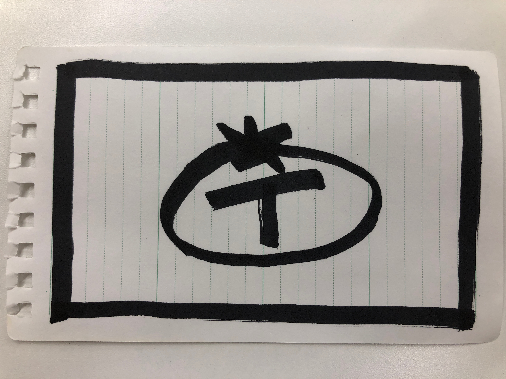
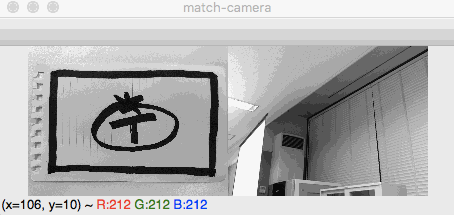

# 機械学習を用いたオブジェクト検出
## ・KerasのVGG16の学習済みデータからのオブジェクト検出
### selectiveAndLearn.py

Fine tuningする前段階の学習済みデータがKerasで用いることができたので, そのデータを用いて物体検出を行った. 入力画像はカメラから受け取り, 物体を切り出すのにはKerasのSelective Searchを用いた.

Mac book airで1フレームあたりの処理時間が約30秒で, リアルタイムと言うよりは連続で処理されるだけのプログラムとなった. ただし, グレースケールで画像を評価している上, 特徴点検出がうまく行えないオブジェクトを検出できるので, データセットの量や見つけたいものに限定した教師画像によって汎用的な場面で用いることができる.

"Selective Searchを使った映像からの物体検出にチャレンジ" AI coordinator
https://ai-coordinator.jp/selective-search
Selective Searchのスクリプトを参考にした.

"KerasでVGG16を使う" 人工知能に関する断創録
http://aidiary.hatenablog.com/entry/20170104/1483535144
VGG16の学習済みデータの利用方法を参考にした.

## ・Kerasで1つの物体を学習させてのオブジェクト検出
### selectiveAndLearn2.py

下に示す特徴量検出を用いたオブジェクト検出と対照的に, 機械学習を用いてオブジェクト検出を行った. ただし, オブジェクトの傾きの学習はせず, 検出したオブジェクトを正方形で示した.

# 特徴量検出を用いたオブジェクト検出

## ・A-KAZE特徴量検出器, Brute-Force＆kNNを用いたオブジェクト検出
### featureMatch.py

元画像のリサイズ, 特徴点検出の重み, 特徴点の最低検出数などのパラメータでうまくいくか変わる. 元画像が平面である場合に限定することで単純な画像でもマッチングできている.

"OpenCV 3とPython 3で特徴量マッチング（A-KAZE, KNN）" Qiita
https://qiita.com/hitomatagi/items/caac014b7ab246faf6b1
特徴点マッチングの際に用いる各パラメータを参考にした.

"特徴点のマッチングとHomographyによる物体検出" OpenCV
http://labs.eecs.tottori-u.ac.jp/sd/Member/oyamada/OpenCV/html/py_tutorials/py_feature2d/py_feature_homography/py_feature_homography.html
枠の表示方法を参考にした.
